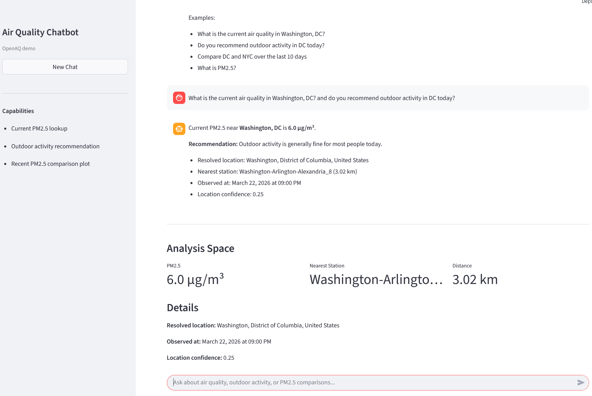
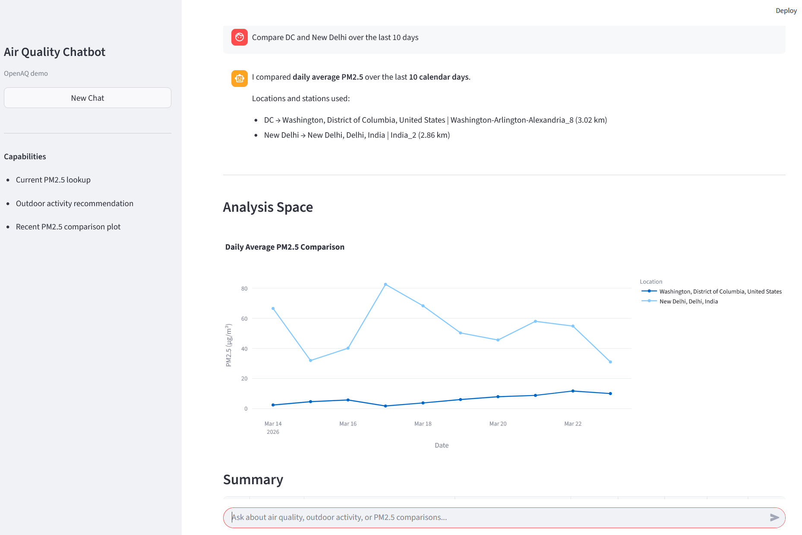

# 🌬️ Air Quality Chatbot (OpenAQ + LLM Demo)

An interactive chat-based air quality assistant powered by:

- 🌍 OpenAQ API (real-time + historical PM2.5 data)
- 🧠 Lightweight LLM-based query understanding
- 📊 Streamlit UI with built-in analysis space (plots + summaries)

---

## 🚀 Demo

### Chat + Current Air Quality


### Historical Comparison + Plot


---

## ✨ Features

### Natural Language Chat
- Current air quality
- Outdoor activity recommendation
- Historical comparison

### Real-Time Data
- OpenAQ API integration
- Nearest station selection

### Visualization
- Time-series plot
- Summary statistics

---

## 🏗️ Architecture

┌──────────────────────────────────────────────────────────────┐
│                         USER INTERFACE                       │
│              (Streamlit Chat UI — app/*.py)                  │
│                                                              │
│   Chat Input │ Chat History │ Analysis Space (Plot + Table)  │
└──────────────────────────┬───────────────────────────────────┘
                           │
                           ▼
┌──────────────────────────────────────────────────────────────┐
│                    CHAT ROUTER LAYER                         │
│               (services/chat_router.py)                      │
│                                                              │
│   - Intent Detection (current / advisory / historical)        │
│   - Location Extraction                                      │
│   - Query Parsing                                            │
└──────────────────────────┬───────────────────────────────────┘
                           │
        ┌──────────────────┼──────────────────┐
        │                  │                  │
        ▼                  ▼                  ▼

┌────────────────┐  ┌──────────────────────┐  ┌──────────────────────┐
│ CURRENT SERVICE│  │ ADVISORY SERVICE     │  │ HISTORICAL SERVICE   │
│                │  │                      │  │                      │
│ PM2.5 lookup   │  │ Rule-based decision  │  │ Time-series builder  │
│                │  │                      │  │ Daily aggregation    │
└───────┬────────┘  └──────────┬───────────┘  └──────────┬───────────┘
        │                       │                         │
        ▼                       ▼                         ▼

┌──────────────────────────────────────────────────────────────┐
│                     DATA ACCESS LAYER                        │
│                                                              │
│   station_service.py                                         │
│     - Nearest station (Haversine distance)                  │
│                                                              │
│   openaq_client.py                                           │
│     - Latest measurement (current)                          │
│     - Raw measurements (historical)                         │
└──────────────────────────┬───────────────────────────────────┘
                           │
                           ▼
┌──────────────────────────────────────────────────────────────┐
│                     EXTERNAL SERVICES                        │
│                                                              │
│   OpenAQ API     → Real-time + historical PM2.5              │
│   Nominatim API  → Geocoding (text → lat/lon)                │
└──────────────────────────────────────────────────────────────┘

                           │
                           ▼
┌──────────────────────────────────────────────────────────────┐
│                    ANALYSIS & VISUALIZATION                  │
│                                                              │
│   plot_service.py                                            │
│     - Time-series plot (PM2.5 comparison)                   │
│                                                              │
│   pandas aggregation                                         │
│     - Daily average                                          │
│     - Summary statistics (mean / max / min)                 │
└──────────────────────────────────────────────────────────────┘

                           │
                           ▼
┌──────────────────────────────────────────────────────────────┐
│                    CONFIGURATION LAYER                       │
│                                                              │
│   config.yaml                                                │
│     - API settings                                           │
│     - Paths                                                  │
│                                                              │
│   .env                                                       │
│     - API keys (OpenAQ, LLM)                                │
└──────────────────────────────────────────────────────────────┘

---

## ⚙️ Setup

```bash
git clone https://github.com/YOUR_USERNAME/air-quality-chatbot.git
cd air-quality-chatbot
pip install -r requirements.txt
```

Create `.env`:

```
OPENAQ_API_KEY=your_api_key_here
```

Run app:

```bash
python -m streamlit run app/streamlit_chat_demo.py
```

---

## 📊 Example Queries

- What is the current air quality in Washington, DC?
- Do you recommend outdoor activity in DC today?
- Compare DC and NYC over the last 10 days

---

## 📌 Author

Junhyun Seo (NASA Goddard Space Flight Center / Morgan State University)
